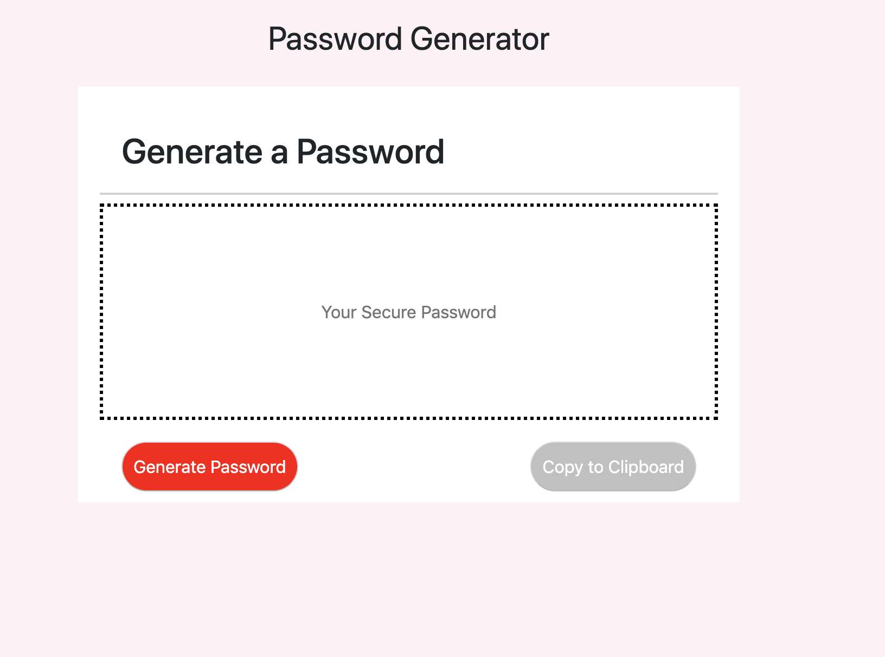
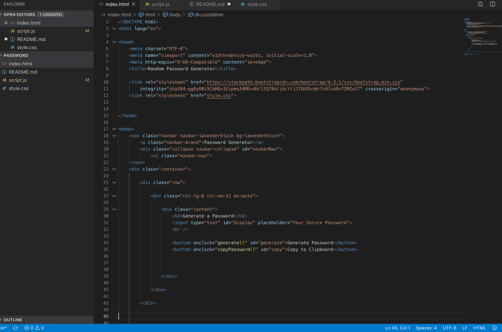

## JavaScript: Password Generator

## Description

I have created an application that generates a random password based on user-selected criteria. This app will run in the browser and feature dynamically updated HTML and CSS powered by your JavaScript code.

The user will be prompted to choose from the following password criteria:
Length, Character type, Special characters, Numeric characters, Lowercase characters, and Uppercase characters.
The application should validate user input and ensure that at least one character type is selected.

Once all prompts are answered, the user will be presented with a password matching the answered prompts. The password will be displayed in the text field and can also be copied to your clipboard.

## Business Context

This app can be very useful for anyone who needs a strong password. Large companies that need to be able to save time and have an app that can genberate these random strong passwords would find this app to be very useful.

## Credits
One website that I happen to use quite a bit to execute this portfolio is https://www.w3schools.com/html/. Your more than welcome to use them. Also https://www.freecodecamp.org/ has alot of material that helped out.
I also would like to give credit to all the study groups that we had this week. They were able to show me more than one pair of eyes is able to break down a problem.
Special credit goes to the team of instructors.

## Submission on BCS

* https://alexpr704.github.io/password/
* https://github.com/AlexPR704/password.git

## License
MIT License

Copyright (c) [2019] [Alexander Garcia]

Permission is hereby granted, free of charge, to any person obtaining a copy
of this software and associated documentation files (the "Software"), to deal
in the Software without restriction, including without limitation the rights
to use, copy, modify, merge, publish, distribute, sublicense, and/or sell
copies of the Software, and to permit persons to whom the Software is
furnished to do so, subject to the following conditions:

The above copyright notice and this permission notice shall be included in all
copies or substantial portions of the Software.

THE SOFTWARE IS PROVIDED "AS IS", WITHOUT WARRANTY OF ANY KIND, EXPRESS OR
IMPLIED, INCLUDING BUT NOT LIMITED TO THE WARRANTIES OF MERCHANTABILITY,
FITNESS FOR A PARTICULAR PURPOSE AND NONINFRINGEMENT. IN NO EVENT SHALL THE
AUTHORS OR COPYRIGHT HOLDERS BE LIABLE FOR ANY CLAIM, DAMAGES OR OTHER
LIABILITY, WHETHER IN AN ACTION OF CONTRACT, TORT OR OTHERWISE, ARISING FROM,
OUT OF OR IN CONNECTION WITH THE SOFTWARE OR THE USE OR OTHER DEALINGS IN THE
SOFTWARE.